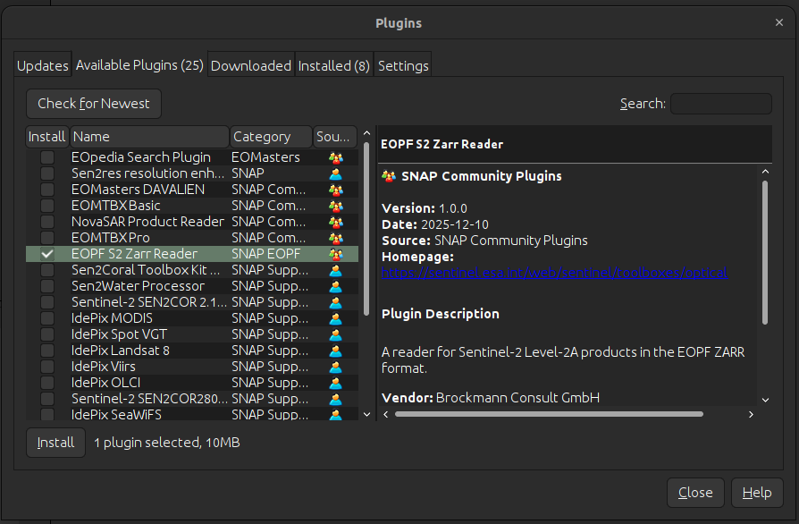

# SNAP EOPF Prototype Reader for Sentinel-2 L2A Products

This repository contains a prototype **SNAP reader** for the new
**EOPF Sentinel-2 Level-2A Zarr sample products**, provided by the
**EOPF Zarr Sample Service**. Its purpose is to demonstrate compatibility
between the EOPF Zarr format and the SNAP processing ecosystem.

> **Note**
> - This reader is a **prototype** and currently supports only **Sentinel-2 L2A** Zarr products.
> - Support for additional product types will be introduced in future SNAP development stages.

---

## Installation

### Install SNAP

Download and install **SNAP version 13** following the official instructions provided by:
https://step.esa.int/main/download/snap-download/

After installation, start SNAP to proceed with plugin installation.

---

## Install the EOPF Sentinel-2 L2A Zarr Prototype Reader

The **EOPF Sentinel-2 L2A Zarr Prototype Reader** is distributed as a **SNAP Community Plugin**.

To install it:

1. Open SNAP.
2. Go to **Tools → Plugins**.
3. Select the **Available Plugins** tab.
   You will see a window similar to the one shown below:

   

4. Locate **EOPF S2 Zarr Reader** in the list.
5. Check the box and click **Install**.
6. Follow the prompts and restart SNAP if prompted.

---

## Using the EOPF Sentinel-2 L2A Zarr Prototype Reader

1. Open the
   **[EOPF Sentinel Zarr Sample Service: STAC API for Sentinel-2 L2A](https://stac.browser.user.eopf.eodc.eu/collections/sentinel-2-l2a?.language=en)**.
2. Select a **STAC Item** and locate the asset **“Zipped EOPF Product”**.
3. Click the **Download** button.
   This triggers a processing workflow that packages the Zarr sample into a ZIP file
   and downloads it to your local machine.
4. Once downloaded, import the product into SNAP by either:
   - dragging and dropping the ZIP file into the **Product Explorer**, or
   - using **File → Open Product…**
5. After loading, you can interact with the product in SNAP as usual. For general
   guidance and available processing features, see the **[STEP documentation](https://step.esa.int/main/)**.
